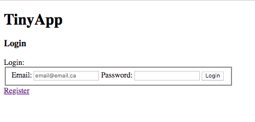
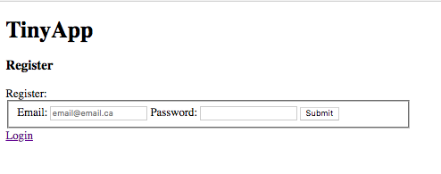
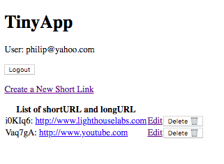
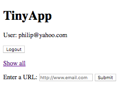

#**TinyApp Project

TinyApp is a URL shortener web application that is designed to facillitate more efficient data commmunication and media sharing on the web

##Screenshot

##Project Dependencies

bcrypt
body-parser
cookie-parser
cookie-session
ejs
express

##Setup Steps

download the project and run npm install to install all the dependencies
run 'node express_server.js' on your Command line
then run localhost: in your browser, where PORT is the port you have set in express_server.js, note by default it is set to 8080
